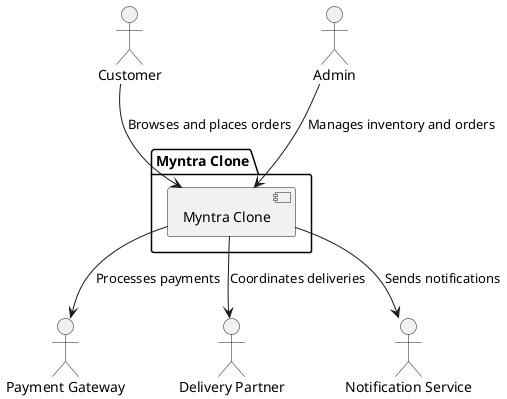

## 1. **System Context Diagram**

---
## 2. *Conatiner Diagram*
![PHOTO-2024-11-18-14-30-11](https://www.plantuml.com/plantuml/png/fLRDSjis4BxhARO-EJEoT6XEFSMIa_vCtAgMKnypIt0jeG415hkqgkdqtGkiA9AYN3KpzSK0nU_dm-v2UiU2KPhAJRwnthYc9DYArFpTV1vnDzjOsJP5mnHDy49UPYPKyzgXpvWRbjBPOhvyUxFAZpxTVvnNo48nFVgyJ0YqdkAiplmJiU88xlTU8iBI1Kzm0yktqBq7TnOt4Ql9P4MHWxys3KkeA4xXQjakhzBwlIyXMuBTDe3rIGwDCEoILv1j9s6onEpgpP4Doyhw1B_D_pFFFNhS42UA5_8IuXumCOT44I7KYLLiy9mP9ft7wnqLjtMTq4zKG5evQ_9xIlX0oSWKVhD2UVkOl3n7FRSIdaCyCJRD4Keezd1CoI01YXXsJ6gaRgBPOjhKCPID4NNI6wb2OHqTlDph-bKxy7FQlz1L_nRMjRhfTVNas5RMOOJdnflCWCxA7f3rI5FgZ3jny7aH6bzYt5yNQBwaZ4bYSLZ1ckABDNJr1lwQGFhhRMDjlqUX7UvpALO_GhlJmlvPHsAU_SvvzmFwqX53f3yQOk5ybbNl9gbKNI0zcv5G8zlMHbPAE_BIdixHNvPPrz7w3In2aA6gDfWB6-jLYeav0oljcIfHdIksTUf5LuS75zIEBTX28Td39AgINLkUAuLOKknrVidRhyYaiAnbSXf_a96OQfOsh-J1VGewpACFlYPF2sLLY9HwgjGI_JreuB98W3iKB919mVlrhn-LDAK-bg14mUd1EK-xKPW2YJcT1qwWf9tW7t9Jh7MhlBTFQrX_Eo2sbPhKkWgADT3URk3i5-gAKM-3XCFyFv0Rt4RT7R3GQUNXkFR5p07IsMW17XzNwyHpIZESu4zCEl-y3JK4hss-2MFiKVXiY0mwnphLHHObPkrTezV0-_LZYsyL_m_54FUl8zOMZozWpuRb0udP3aQX947hBb6Cfc1rwEkspo-BzvqznhOVdQ67KSjYrAGcKfcZe-EJsyBwPwtXJtUBPKiqpgrS3uGbpv-YbU41eE08hC4kGFNpru1jgZ7K940N6IIYPzJBd__3TJziUWoTwNQqXdsh-FQxTqpp-bTmDq0wl1a9A_JaCjaxycN-DV4F)
@startuml
!include https://raw.githubusercontent.com/plantuml-stdlib/C4-PlantUML/master/C4_Container.puml

title Myntra Clone - C4 Container Diagram

Person(customer, "Customer", "End user who interacts with the Myntra clone.")
Person(admin, "Admin", "Manages inventory and other operations.")

Container(webApp, "Web Application", "React, Vite", "The frontend for Myntra clone, used by customers to browse and purchase products.")
Container(mobileApp, "Mobile Application", "React Native", "Mobile app for customers with similar functionality as the web app.")
Container_Boundary(backend, "Backend Service") {
    Container(apiGateway, "API Gateway", "Express.js", "Handles requests from the web and mobile apps.")
    Container(authService, "Authentication Service", "Spring Boot", "Handles user login and session management.")
    Container(productService, "Product Service", "Spring Boot", "Manages product catalog and inventory.")
    Container(orderService, "Order Service", "Spring Boot", "Handles order processing and tracking.")
    Container(paymentService, "Payment Service", "Spring Boot", "Manages payments and refunds.")
}
Container(db, "Database", "MySQL", "Stores user data, orders, products, etc.")
Container(storage, "File Storage", "AWS S3", "Stores images and static content like product photos.")

Rel(customer, webApp, "Browses and purchases products using", "HTTPS")
Rel(customer, mobileApp, "Uses to shop on the go", "HTTPS")
Rel(webApp, apiGateway, "API calls for business logic", "REST")
Rel(mobileApp, apiGateway, "API calls for business logic", "REST")
Rel(apiGateway, authService, "Authenticates users", "REST")
Rel(apiGateway, productService, "Fetches product details", "REST")
Rel(apiGateway, orderService, "Processes orders", "REST")
Rel(apiGateway, paymentService, "Processes payments", "REST")
Rel(authService, db, "Stores user credentials and session info", "JDBC")
Rel(productService, db, "Reads/Writes product data", "JDBC")
Rel(orderService, db, "Reads/Writes order data", "JDBC")
Rel(paymentService, db, "Records payment transactions", "JDBC")
Rel(productService, storage, "Stores product images", "HTTPS")

Rel(admin, productService, "Manages inventory and products", "Admin Panel")

@enduml
