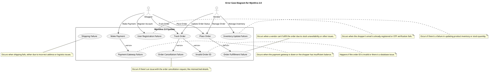

# Error Case Diagram Code

```plantuml
@startuml
title Error Case Diagram for Mynthra 2.0

actor "Shopper" as S
actor "Vendor" as V

rectangle "Mynthra 2.0 System" {
    usecase "Place Order" as UC1
    usecase "Track Order" as UC2
    usecase "Make Payment" as UC3
    usecase "User Registration Failure" as URF
    usecase "Payment Gateway Failure" as PGF
    usecase "Invalid Order ID" as IOI
    usecase "Order Cancellation Failure" as OCF
    usecase "Order Fulfillment Failure" as OFF
    usecase "Inventory Update Failure" as IUF
    usecase "Shipping Failure" as SF
}

' Relationships between actors and use cases
S --> UC1 : Place Order
S --> UC2 : Track Order
S --> UC3 : Make Payment
S --> URF : Register Account

' Error cases linked to relevant use cases
UC3 --> PGF : <<error>> 
UC2 --> IOI : <<error>>
UC2 --> OCF : <<error>>
UC1 --> OFF : <<error>>

' Vendor assists with order management
V --> UC1 : Manage Order
V --> UC2 : Update Order Status
V --> IUF : Manage Inventory

' Notes to provide context for each error case
note right of PGF
Occurs when the payment gateway is down or the shopper has insufficient balance.
end note

note left of IOI
Happens if the order ID is invalid or there is a database issue.
end note

note bottom of OCF
Occurs if there's an issue with the order cancellation request, like mismatched details.
end note

note top of OFF
Occurs when a vendor can't fulfill the order due to stock unavailability or other issues.
end note

note right of URF
Occurs when the shopper's email is already registered or OTP verification fails.
end note

note right of IUF
Occurs if there's a failure in updating product inventory or stock quantity.
end note

note bottom of SF
Occurs when shipping fails, either due to incorrect address or logistics issues.
end note
@enduml
```
