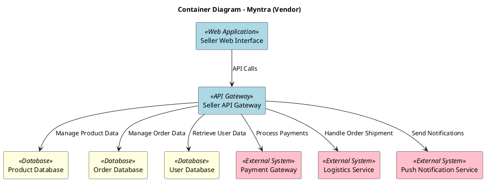
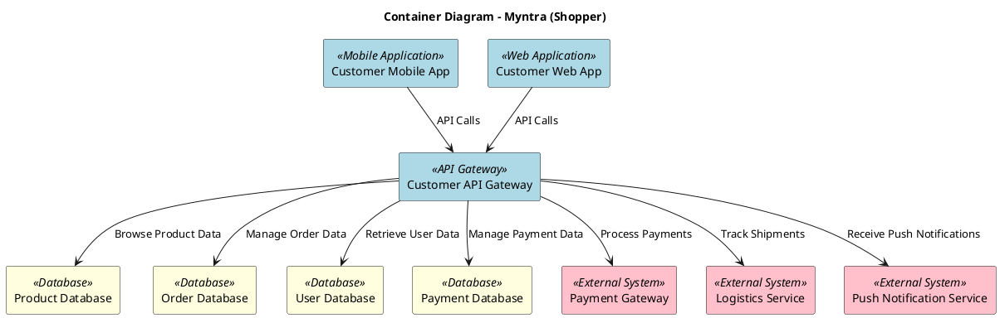
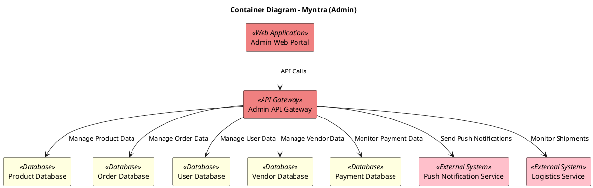

# System Context  Diagram Code

```plantuml
@startuml
' External Actors
actor "Shopper(User)" as Customer
actor "Vendor" as Seller
actor "Admin" as Admin
actor "Payment Gateway" as PaymentGateway
actor "Logistics Service" as LogisticsService
actor "Notification Service" as NotificationService
actor "Customer Support" as CustomerSupport

' System Boundary: Mynthra Clone
package "Mynthra" {

    ' Subsystems
    rectangle "User Registration \nand Authentication" as Registration
    rectangle "Product Browsing \nand Search" as ProductBrowsing
    rectangle "Shopping Cart \nand Checkout" as CartCheckout
    rectangle "Payment Integration" as Payment
    rectangle "Order Management \nand Tracking" as OrderManagement
    rectangle "Seller Functionality" as SellerFunctionality
    rectangle "Ratings and Reviews" as Ratings
    rectangle "Admin Panel" as AdminPanel
    rectangle "Push Notifications" as PushNotifications
    rectangle "Customer Support \nand Chat" as ChatSupport
}

' Relationships between actors and system components
Customer --> Registration : Sign Up/Login
Customer --> ProductBrowsing : Browse Products
Customer --> CartCheckout : Add to Cart/Checkout
Customer --> Payment : Process Payment
Customer --> OrderManagement : Track Orders
Customer --> Ratings : Rate Products/Sellers
Customer --> PushNotifications : Receive Notifications
Customer --> ChatSupport : In-App Chat with Sellers

Seller --> Registration : Register/Login
Seller --> SellerFunctionality : Manage Products/Orders
Seller --> OrderManagement : Manage Orders
Seller --> Ratings : View Customer Ratings/Reviews
Seller --> PushNotifications : Receive Order Notifications
Seller --> ChatSupport : In-App Chat with Customers

Admin --> AdminPanel : Manage Users/Products/Orders
Admin --> OrderManagement : Monitor Orders
Admin --> Payment : Monitor Payments
Admin --> PushNotifications : Send Notifications
Admin --> Ratings : Manage Reviews

' External Interactions
Payment --> PaymentGateway : Process Payment Transactions
OrderManagement --> LogisticsService : Coordinate Shipping/Delivery
PushNotifications --> NotificationService : Send Notifications
ChatSupport --> CustomerSupport : Handle User Issues
@enduml
```
# Container Diagram Codes

## Seller Code

```plantuml
@startuml
!define RECTANGLE rectangle
!define BOLD **<color:Black>**

title Container Diagram - Myntra (Vendor)

' Add primary containers for Seller section
RECTANGLE "Seller Web Interface" as sellerWebInterface <<Web Application>> #lightblue
RECTANGLE "Seller API Gateway" as sellerGateway <<API Gateway>> #lightblue

' Database containers shared with Seller
RECTANGLE "Product Database" as productDB <<Database>> #lightyellow
RECTANGLE "Order Database" as orderDB <<Database>> #lightyellow
RECTANGLE "User Database" as userDB <<Database>> #lightyellow

' External systems shared with Seller
RECTANGLE "Payment Gateway" as paymentSystem <<External System>> #pink
RECTANGLE "Logistics Service" as logisticsService <<External System>> #pink
RECTANGLE "Push Notification Service" as pushNotification <<External System>> #pink

' Relationships for Vendors
sellerWebInterface --> sellerGateway : "API Calls"
sellerGateway --> productDB : "Manage Product Data"
sellerGateway --> orderDB : "Manage Order Data"
sellerGateway --> userDB : "Retrieve User Data"
sellerGateway --> paymentSystem : "Process Payments"
sellerGateway --> logisticsService : "Handle Order Shipment"
sellerGateway --> pushNotification : "Send Notifications"
@enduml
```
## Customer Code

```plantuml
@startuml
!define RECTANGLE rectangle
!define BOLD **<color:Black>**

title Container Diagram - Myntra (Shopper)

' Add primary containers for Shopper section
RECTANGLE "Customer Mobile App" as mobileApp <<Mobile Application>> #lightblue
RECTANGLE "Customer Web App" as webApp <<Web Application>> #lightblue
RECTANGLE "Customer API Gateway" as customerGateway <<API Gateway>> #lightblue

' Database containers shared with Customer
RECTANGLE "Product Database" as productDB <<Database>> #lightyellow
RECTANGLE "Order Database" as orderDB <<Database>> #lightyellow
RECTANGLE "User Database" as userDB <<Database>> #lightyellow
RECTANGLE "Payment Database" as paymentDB <<Database>> #lightyellow

' External systems shared with Shoppers
RECTANGLE "Payment Gateway" as paymentSystem <<External System>> #pink
RECTANGLE "Logistics Service" as logisticsService <<External System>> #pink
RECTANGLE "Push Notification Service" as pushNotification <<External System>> #pink

' Relationships for Shoppers
mobileApp --> customerGateway : "API Calls"
webApp --> customerGateway : "API Calls"
customerGateway --> productDB : "Browse Product Data"
customerGateway --> orderDB : "Manage Order Data"
customerGateway --> userDB : "Retrieve User Data"
customerGateway --> paymentDB : "Manage Payment Data"
customerGateway --> paymentSystem : "Process Payments"
customerGateway --> logisticsService : "Track Shipments"
customerGateway --> pushNotification : "Receive Push Notifications"
@enduml
```
## Admin Code

```plantuml
@startuml
!define RECTANGLE rectangle
!define BOLD **<color:Black>**

title Container Diagram - Myntra (Admin)

' Add primary containers for Admin section
RECTANGLE "Admin Web Portal" as adminPortal <<Web Application>> #lightcoral
RECTANGLE "Admin API Gateway" as adminGateway <<API Gateway>> #lightcoral

' Database containers shared with Admin
RECTANGLE "Product Database" as productDB <<Database>> #lightyellow
RECTANGLE "Order Database" as orderDB <<Database>> #lightyellow
RECTANGLE "User Database" as userDB <<Database>> #lightyellow
RECTANGLE "Vendor Database" as vendorDB <<Database>> #lightyellow
RECTANGLE "Payment Database" as paymentDB <<Database>> #lightyellow

' External systems shared with Admin
RECTANGLE "Push Notification Service" as pushNotification <<External System>> #pink
RECTANGLE "Logistics Service" as logisticsService <<External System>> #pink

' Relationships for Admin
adminPortal --> adminGateway : "API Calls"
adminGateway --> productDB : "Manage Product Data"
adminGateway --> orderDB : "Manage Order Data"
adminGateway --> userDB : "Manage User Data"
adminGateway --> vendorDB : "Manage Vendor Data"
adminGateway --> paymentDB : "Monitor Payment Data"
adminGateway --> pushNotification : "Send Push Notifications"
adminGateway --> logisticsService : "Monitor Shipments"
@enduml
```
