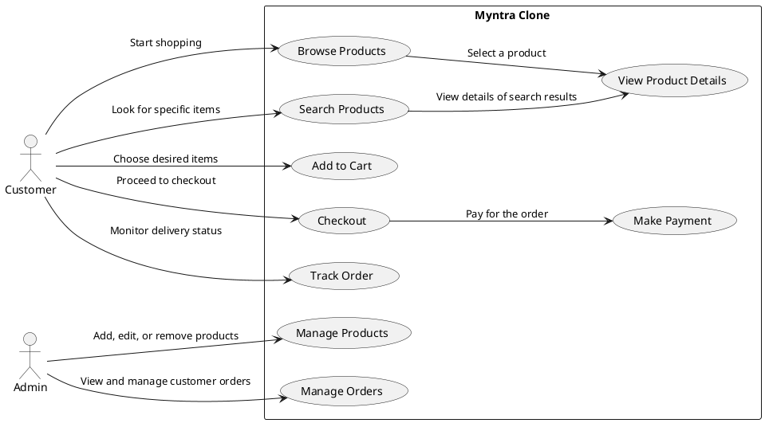

#Use Case Diagram Code

```plantuml
@startuml

left to right direction
skinparam packageStyle rectangle

actor Customer as C
actor Admin as A

package "Myntra Clone" {
    usecase "Browse Products" as UC1
    usecase "Search Products" as UC2
    usecase "View Product Details" as UC3
    usecase "Add to Cart" as UC4
    usecase "Checkout" as UC5
    usecase "Make Payment" as UC6
    usecase "Track Order" as UC7
    usecase "Manage Products" as UC8
    usecase "Manage Orders" as UC9
}

C --> UC1 : "Start shopping"
C --> UC2 : "Look for specific items"
UC1 --> UC3 : "Select a product"
UC2 --> UC3 : "View details of search results"
C --> UC4 : "Choose desired items"
C --> UC5 : "Proceed to checkout"
UC5 --> UC6 : "Pay for the order"
C --> UC7 : "Monitor delivery status"

A --> UC8 : "Add, edit, or remove products"
A --> UC9 : "View and manage customer orders"

@enduml
```
